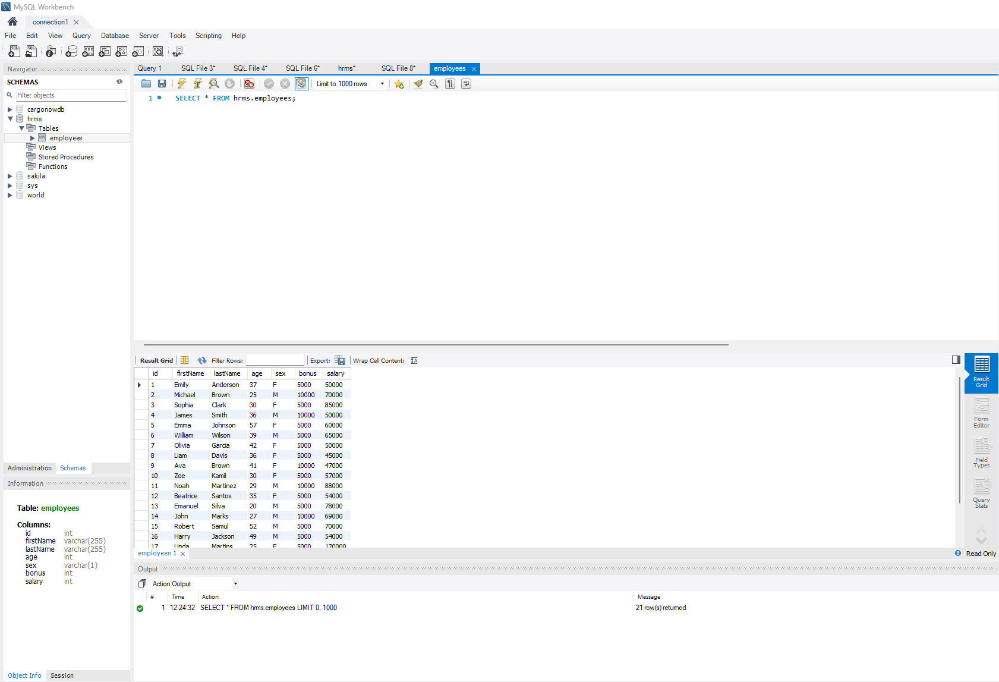
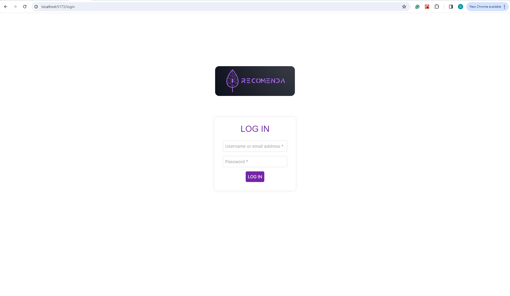
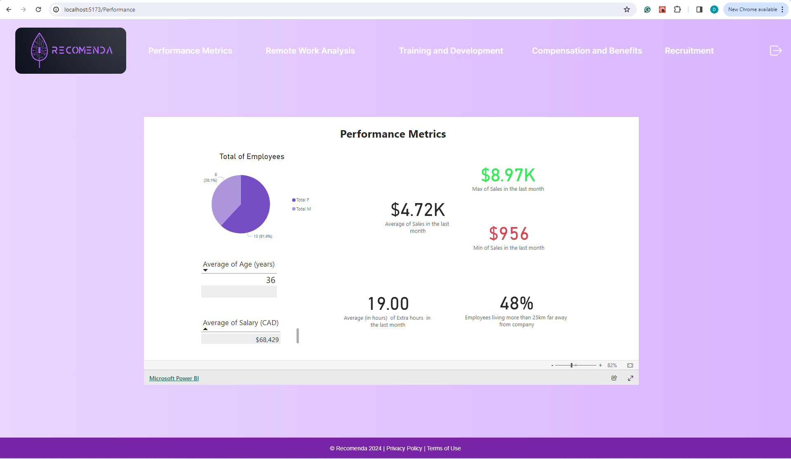
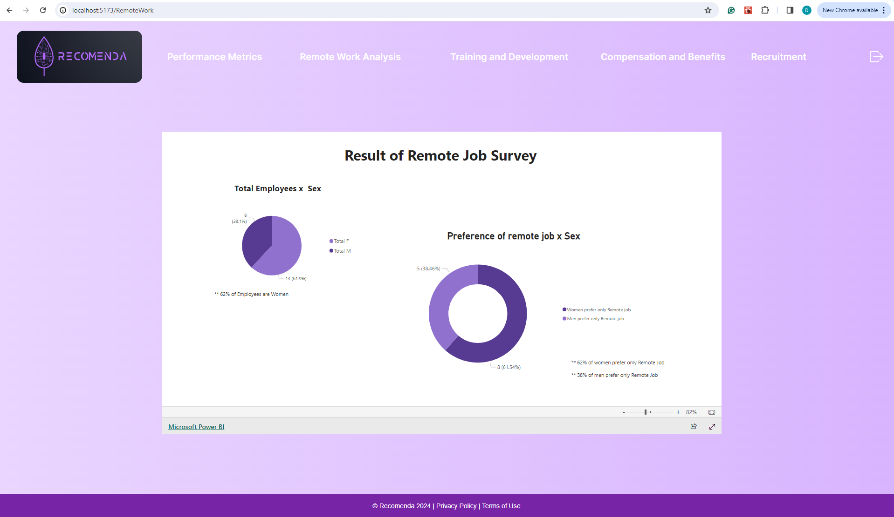
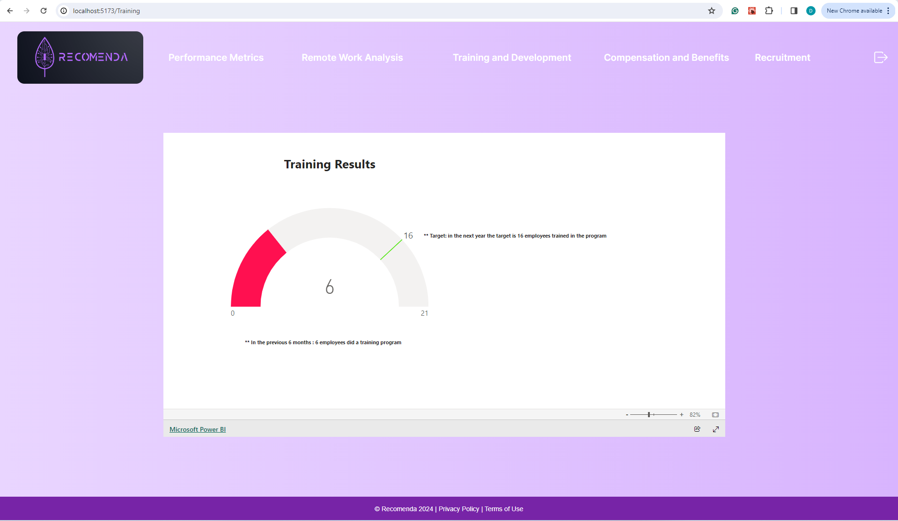
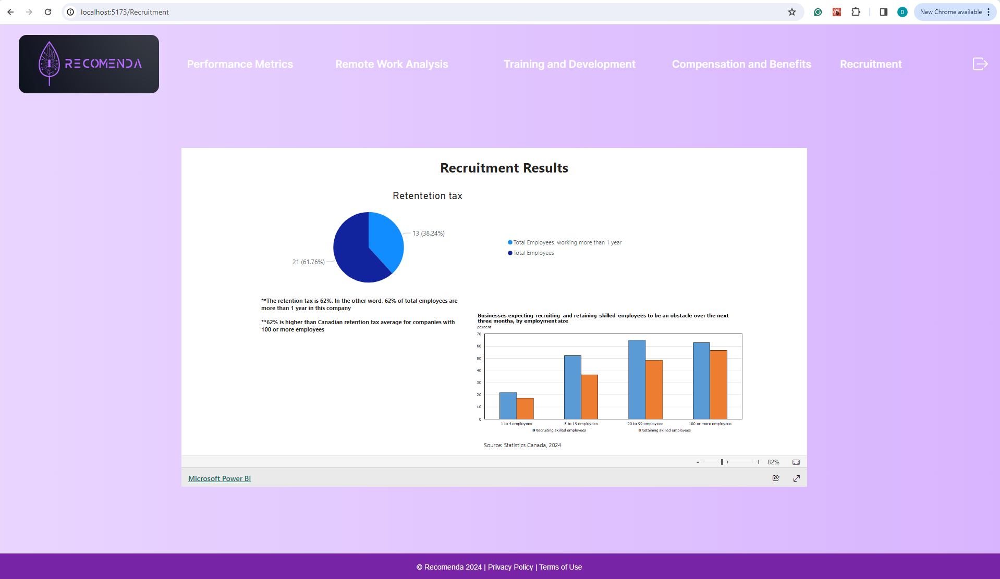
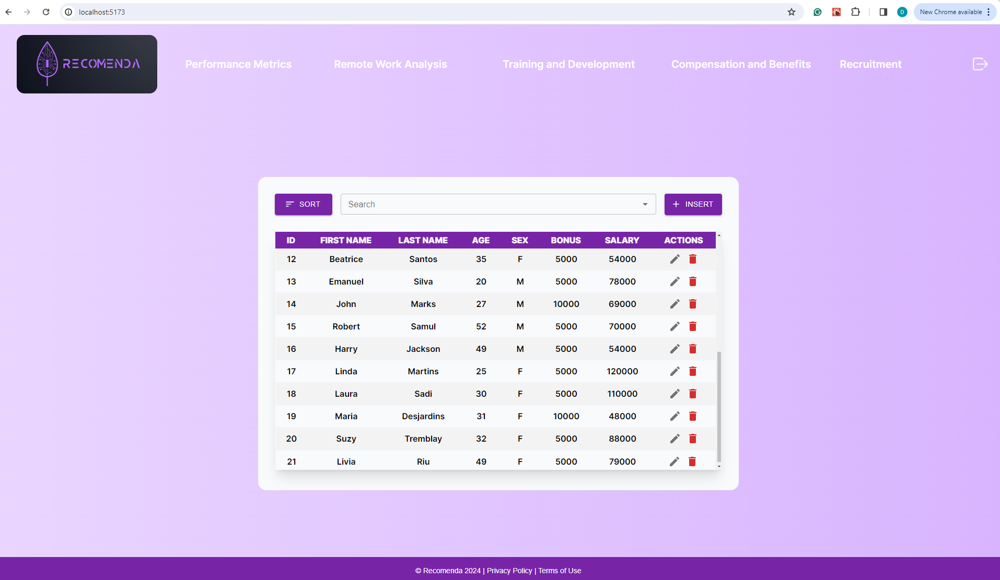
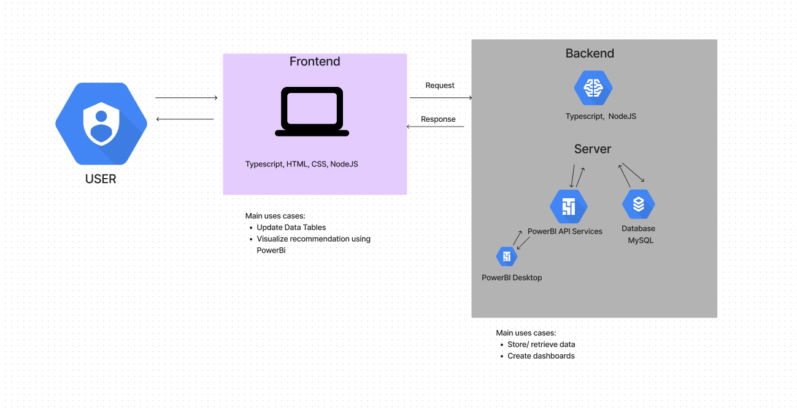

# Recomenda

CAPSTONE PROJECT 

Project Name: Recomenda 
A web application project that uses data from a Human Resources Management System (HRMS) to provide recommendations for managers would be a sophisticated tool, combining data analysis and administrative insights. 
I chose this project because several job positions want people who do HR data analysis.

Objective:
To develop a web-based application that leverages HR data to provide managers recommendations for decisions related to remote work, leave policies, employee engagement, and other HR-related issues.

Key Features:

1. Data Integration:
    - Establish a secure connection to the existing Database to access employee data.

        

2. Authentication:
    - Login with username and password to access the HR data and recommendations.

        

3. Recommendation:
   - Implement algorithms to analyze HR data and generate recommendations.

4. HR Analysis:
- Performance Metrics
    - Key performance indicators (KPIs) like total of employees, average of age, average of salary, average of extra hours. The aim of this page is allowing the manager see the overview of the company. 

        

- Remote Work Analysis
   - Provide insights on the impact of remote work on productivity, employee satisfaction, and preference to remote job.

        

- Training and Development
    - Information on employee training programs and the target to achieve in next year.

        

- Compensation and Benefits
    - Data on promotion, bonuses, benefits, and other compensation metrics.

        
  
- Recruitment 
    - Analyzing retention tax of employees and show the comparison of Canadian retention tax. 

        

5. Dashboard:
    - Create a user-friendly dashboard for managers with customizable widgets to display relevant data and insights.
        
        

Technology Stack:
- Back-End: Node.js / Typescript
- Front-End: React / Typescript
- Database: MySQL
- Dashboards: PowerBI 

Diagram:

